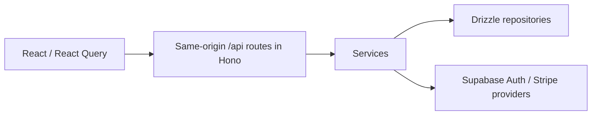

# Hikari by CoreMVP

CoreMVP's open-source Next.js application foundation.

Build an individual-account application with email/password authentication, a protected dashboard, and one recurring Stripe subscription. Checkout, verified webhooks, persisted subscription state, and server access checks are connected so you can build your product on top of them.

Hikari is MIT licensed and independently maintained. [CoreMVP](https://coremvp.com) provides the commercial startup application foundation for company-level capabilities.

## Run locally

Install [Bun 1.3.14](https://bun.sh), Node.js 20.9 or later, and a running Docker-compatible daemon. Start in a fresh clone:

```bash
git clone https://github.com/coremvp/hikari.git
cd hikari
bun install
bunx supabase start
./coremvp env sync
bun run dev
```

Open [localhost:3000](http://localhost:3000), create an account, and confirm your email in the local Supabase mailbox at [127.0.0.1:55424](http://127.0.0.1:55424). You can then open Dashboard and Account. Password recovery uses the same mailbox.

`env sync` writes the local Supabase connection settings to ignored `.env.local` and preserves existing Stripe settings. `./coremvp env list` reports whether each required variable is set, without displaying values. Authentication works before you configure Stripe; subscription features require the billing settings below.

The local Supabase project is `hikari-oss`, using ports 55420–55424. Its services are separate from other projects on your machine. Stop your development server and run `bunx supabase stop` when finished. Use `bunx supabase db reset` only to reset disposable local data.

## Connect a subscription

Use a Stripe test account for development. Create one active, fixed-amount recurring price in the [Stripe Dashboard](https://dashboard.stripe.com/test/products). Configure Customer Portal in the same account, enabling the subscription-management actions you want to support.

Set these server-only values in ignored `.env.local`:

| Variable                | Value source                                              |
| ----------------------- | --------------------------------------------------------- |
| `STRIPE_SECRET_KEY`     | Test secret key from the selected Stripe account          |
| `STRIPE_PRICE_ID`       | The one approved recurring price, beginning with `price_` |
| `STRIPE_WEBHOOK_SECRET` | Signing secret from the local listener below              |

Forward subscription events to the application:

```bash
stripe login
stripe listen --events customer.subscription.created,customer.subscription.updated,customer.subscription.deleted,customer.subscription.paused,customer.subscription.resumed --forward-to localhost:3000/api/webhooks/stripe
```

Copy the listener's signing secret into `.env.local` and restart `bun run dev`. Keep the listener running while testing Checkout. Sign in, open Account, and select **Start subscription**. Complete payment using Stripe's `4242 4242 4242 4242` test card, a future expiry, and any three-digit CVC. Refresh the subscription display after returning from Stripe.

Subscription access requires persisted `active` or `trialing` state on your configured price. Scheduled cancellation keeps access until Stripe changes that status. Other statuses and other prices deny access. Returning from Checkout does not grant access.

Existing subscriptions open Customer Portal instead of another Checkout. Open sessions are reused during repeated Checkout requests. Portal price changes must remain on the approved price if you want them to keep application access.

The webhook accepts the five subscription lifecycle events listed above. It verifies the original request body, retrieves the current subscription from Stripe, and upserts its state. Updates for each subscription are serialized with a Postgres transaction lock. Failed retrieval or persistence returns an error so Stripe can retry; inspect failed deliveries in Stripe Workbench. Events for customers outside this application's customer mapping are acknowledged without creating access.

## Verify the application

```bash
bun run lint
bun run typecheck
bun run test
bun run build
bunx playwright install chromium
./coremvp e2e auth
bun run test:integration
./coremvp e2e billing:subscription
```

The Auth journey uses the running local application, Supabase Auth, and confirmation/recovery emails in the local mailbox. It checks the protected dashboard/account and API, signin, logout, and password recovery.

Unit tests cover subscription access and controlled provider-state convergence. Database integration uses the real local database and application service/repository/API with signed Stripe fixtures. It also checks that anonymous and authenticated Supabase clients cannot read or write billing tables. No Stripe API is called by those tests.

The subscription E2E needs a configured Stripe test account, the running listener, the application, and local Supabase. It creates a real test subscription through Checkout, waits for webhook-backed access, opens Customer Portal, and cancels its test subscription during cleanup. Missing settings fail the journey instead of silently skipping it. Do not use a live Stripe key.

## Deploy on Vercel and Supabase

Use a fresh Supabase project and one Vercel Next.js project. Hosted deployment and live Stripe verification must be completed for your configuration before you release your application.

1. Create a Supabase project. Link this clone to that exact project and apply the migrations:

   ```bash
   bunx supabase login
   bunx supabase link --project-ref <your-project-ref>
   bunx supabase db push
   ```

2. In Supabase Auth, set Site URL to your final HTTPS application origin. Add these Redirect URLs, replacing `<your-app>` with your application's hostname:

   ```text
   https://<your-app>/auth/callback
   https://<your-app>/auth/callback?next=/reset-password
   https://<your-app>/auth/confirm
   ```

   Keep email confirmation enabled. For an initial test with Supabase's default email templates, open confirmation and recovery links in the same browser and device where you started the flow. Hikari's callback exchanges the PKCE code for a session. When your Supabase configuration permits custom templates, use the corresponding files in `supabase/templates/`; their links use `SiteURL` and `TokenHash`.

   The default hosted email service sends only to your Supabase organization's members and has a low rate limit. Free projects using that service may reject template edits. Configure [Auth SMTP delivery in Supabase](https://supabase.com/docs/guides/auth/auth-smtp) and validate delivery to your intended users before opening signup. Supabase Auth continues to own the email flow.

3. Create or link the Vercel project from the Hikari root:

   ```bash
   bunx vercel login
   bunx vercel link
   ```

   Use the Next.js preset. The checked-in `vercel.json` selects Bun 1.x and the locked Bun install/build commands.

4. Add these environment variables through the Vercel Dashboard or interactive `bunx vercel env add <name>` prompts. Add them to the deployment environment you will use.

   | Variable                               | Configuration                                     |
   | -------------------------------------- | ------------------------------------------------- |
   | `APP_URL`                              | Final HTTPS origin, with no path or query         |
   | `NEXT_PUBLIC_SUPABASE_URL`             | This Supabase project's API URL                   |
   | `NEXT_PUBLIC_SUPABASE_PUBLISHABLE_KEY` | This project's publishable key                    |
   | `DATABASE_URL`                         | Supabase transaction-pooler URL, with TLS enabled |
   | `STRIPE_SECRET_KEY`                    | Secret key for the selected Stripe test account   |
   | `STRIPE_PRICE_ID`                      | Your one approved recurring test price            |
   | `STRIPE_WEBHOOK_SECRET`                | Signing secret for the hosted endpoint            |

   Only the two `NEXT_PUBLIC_SUPABASE_*` values are public. Never put database credentials or Stripe secrets in a public variable. Follow [Supabase's connection guide](https://supabase.com/docs/guides/database/connecting-to-postgres) for the pooler and TLS settings. Drizzle uses `prepare: false` for transaction pooling.

5. Register `https://<your-app>/api/webhooks/stripe` in the same Stripe account for the five lifecycle events listed above. Use this endpoint's signing secret, rather than the local listener secret. Configure Customer Portal in that account.

6. Deploy:

   ```bash
   bunx vercel deploy --prod
   ./coremvp prod e2e smoke https://<your-app>
   ```

   Smoke checks the hosted page, application liveness, and anonymous account rejection. It does not prove hosted authentication or billing. On the deployed application, confirm a fresh account, sign in, recover its password, complete Stripe test Checkout, verify active access in Dashboard, and open Customer Portal. Check successful signed delivery and the durable subscription row in your selected providers.

The schema transition refuses to discard nonempty legacy Hikari tables. Existing deployments need a backup and a separately planned data migration. Do not reset a hosted project to bypass that guard. The relaunch quickstart and deployment path target fresh projects.

## Extend your product



Place pages in `src/app`, HTTP parsing and validation in `src/api`, business rules in `src/services`, persistence in `src/repositories`, and external calls in `src/providers`. The Next.js Auth callback routes handle provider protocols; application APIs use Hono.

Use `requireUser()` for authenticated operations and `billing.requireAccess(user.id)` for subscriber operations. Both run on the server. Never authorize from browser-editable metadata, cookie presence, a client cache, or Checkout query parameters.

`customers` stores the account-to-Stripe mapping. `subscriptions` stores subscription ID, customer, status, recurring price, cancellation flag, and period end. Supabase browser roles have no table privileges or client policies. Add your application's tables through migrations and update the Drizzle schema alongside them. App tables that remain server-owned should keep that same boundary.

Hikari includes an individual account and one subscription path. Organizations, memberships/roles, Projects, lifetime payments, guest checkout, admin, AI/RAG, monitoring, and analytics belong to the commercial CoreMVP product. Hikari does not include embedded Docs/Blog, a newsletter, or an app-level email provider.

## License

[MIT](LICENSE). Preserve the copyright and permission notice when redistributing the source. The CoreMVP name does not change the rights granted by the MIT license.
