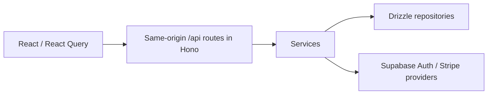

# Hikari by CoreMVP

Build an individual-account application with email/password authentication, a protected Dashboard, recurring Stripe subscriptions, and embedded Docs and Blog. Hikari connects Checkout, verified webhooks, persisted subscription state, and server access checks in one open-source Next.js application.

Hikari suits builders who can run terminal commands and want a free foundation to customize. You receive source code and operate the application with your own providers. It is independently maintained and [MIT licensed](LICENSE), including commercial use and modification; preserve the copyright and permission notice when redistributing it. Dashboard charts and Organization/Project selectors are visual examples, ready for your own product features and authorization.

**Start here:** [run locally](#run-locally) and create your first account. Stripe and hosted provider accounts can wait.

Existing guides: [Run locally](src/content/docs/getting-started/index.mdx) · [Subscriptions](src/content/docs/features/payments.mdx) · [Deployment](src/content/docs/deployment/vercel.mdx) · [Project structure](src/content/docs/getting-started/project-structure.mdx) · [Testing](src/content/docs/reference/testing.mdx) · [Help](#get-help).

Use the [environment reference](src/content/docs/reference/environment.mdx) to choose Local, Preview or Production settings. Local signup uses local Supabase and ignored `.env.local`. Hosted candidates use Vercel Preview settings and a separate Supabase project; the public deployment uses Production settings. Pricing IDs and amounts stay in source configuration, with matching Stripe credentials in the selected environment.

## Run locally

Install these before cloning:

- [Git](https://git-scm.com/downloads/) and a Bash-capable shell for `./coremvp`.
- [Bun 1.3.14](https://bun.sh/docs/installation), the version pinned in `package.json`.
- [Node.js](https://nodejs.org/en/download), satisfying `>=20.19.0`. Choose a [supported LTS release](https://nodejs.org/en/about/previous-releases); Next.js runs under Node.
- [Docker](https://docs.docker.com/get-started/get-docker/) or a compatible runtime, with its daemon running. Follow the vendors’ OS requirements; an installed Docker CLI alone is insufficient.

Check readiness:

```bash
git --version
bun --version
node --version
docker info --format '{{.ServerVersion}}'
```

Start in a fresh clone:

```bash
git clone https://github.com/coremvp/hikari.git
cd hikari
bun install
bunx --no-install supabase --version
bunx --no-install supabase --help
bunx supabase start
bunx supabase migration up --local
./coremvp env sync
bun run dev
```

Open [localhost:3000](http://localhost:3000) and create an account. Signup signs you in immediately and opens Dashboard. Email confirmation is disabled. Password recovery emails arrive in the local Supabase mailbox at [127.0.0.1:55424](http://127.0.0.1:55424).

`bun install` installs Supabase CLI 2.119.0 from this project's dev dependencies. The version/help commands verify that local installation. No global Supabase installation, `supabase init`, provider login, or hosted Supabase project is needed. See the [local Supabase requirements](https://supabase.com/docs/guides/local-development/cli/getting-started).

`env sync` writes the local Supabase connection settings to ignored `.env.local` and preserves existing Stripe settings. `./coremvp env list` reports whether each required variable is set, without displaying values. Authentication works before you configure Stripe; subscription features require the billing settings below.

`migration up --local` applies the repository’s pending migrations to this local project, including the billing tables. Run it before the first signup. If a migration reports existing legacy application data, stop and preserve it; this quickstart targets a fresh project. It does not require a database reset.

The local Supabase project is `hikari-oss`, using ports 55420–55424. Its services are separate from other projects on your machine. Stop your development server and run `bunx supabase stop` when finished. Use `bunx supabase db reset` only to reset disposable local data.

## Choose your next step

- **First local account:** the tools above and local Supabase are sufficient. Follow [Run locally](src/content/docs/getting-started/index.mdx).
- **Optional billing:** add a Stripe test account and Stripe CLI, then follow [Subscriptions](src/content/docs/features/payments.mdx). The guide also explains missing access after Checkout and scheduled cancellation.
- **Deployment:** use your own hosted Supabase and Vercel accounts, configure recovery email delivery, and add Stripe when enabling billing. Follow [Deploy to Vercel](src/content/docs/deployment/vercel.mdx) and its hosted verification steps.

Free MIT source does not include hosting, database usage, domains, email delivery, or payment processing. Local signup needs no purchased hosted plan. Review current [Supabase](https://supabase.com/pricing), [Vercel](https://vercel.com/pricing), and [Stripe](https://stripe.com/pricing) pricing and terms for your usage and region.

### When to consider CoreMVP

Hikari includes individual accounts, recurring subscriptions, Docs and Blog. CoreMVP is a premium startup application foundation delivered as source code. Consider it when you need shared Organizations with invitations and roles, persisted Projects, or lifetime/one-time payments with guest checkout. Those paths connect collaboration and payment to account ownership so you can build on them.

Compare the [CoreMVP Next.js product](https://coremvp.com/en/products/nextjs) and [CoreMVP demo](https://nextjs.coremvp.com). Visit [CoreMVP](https://coremvp.com/en#pricing) for source access and current commercial terms; neither foundation includes hosting. For a broader map of the work your application still needs, read [A Good Startup Foundation](https://coremvp.com/en/help/good-startup-foundation).

Follow [From Hikari to CoreMVP](src/content/docs/coremvp.mdx) for the separate repository and local-start path, including what to assess before bringing custom code and data across. Read [Building Beyond Hikari](src/content/blogs/building-beyond-hikari.mdx) for the shared-workspace design behind the additional foundation. Hikari’s example subscription plans test your application’s billing; they do not include CoreMVP source or automatically migrate your application.

## Connect a subscription

Use a Stripe test account for development. The included pricing configuration contains example catalog IDs; replace them with your account’s IDs when building your own application. Create monthly and yearly fixed-amount recurring prices for Starter, Pro, and Business in the [Stripe Dashboard](https://dashboard.stripe.com/test/products). In that account's Customer Portal settings, enable payment-method updates, invoice history, and cancellation at the end of the billing period. Leave plan and quantity changes disabled until you deliberately configure upgrades in Customer Portal. The [Subscriptions guide](src/content/docs/features/payments.mdx) shows the controls and complete setup. Deploy the matching `src/config/pricing.config.ts` with your application; Product and Price IDs are not environment variables.

Set the Product and monthly/yearly Price IDs for each subscription tier in [src/config/pricing.config.ts](src/config/pricing.config.ts). Use prices from your own Stripe test account, and set `priceMonthly` and `priceYearly` to their matching displayed amounts. Keep only the Stripe secret key and webhook signing secret in ignored `.env.local`:

| Variable                | Value source                                     |
| ----------------------- | ------------------------------------------------ |
| `STRIPE_SECRET_KEY`     | Test secret key from the selected Stripe account |
| `STRIPE_WEBHOOK_SECRET` | Signing secret from the local listener below     |

Install the [Stripe CLI](https://docs.stripe.com/cli/install) and check `stripe --version` before continuing. Then forward subscription events to the application:

```bash
stripe login
stripe listen --events customer.subscription.created,customer.subscription.updated,customer.subscription.deleted,customer.subscription.paused,customer.subscription.resumed --forward-to localhost:3000/api/webhooks/stripe
```

Copy the listener's signing secret into `.env.local` and restart `bun run dev`. Keep the listener running while testing Checkout. Open **Pricing** on the homepage and choose Monthly or Yearly, then a plan. Sign in or create an account when prompted; the selected test Checkout opens automatically. Account’s **Start subscription** action continues to use monthly Starter. Complete payment using Stripe's `4242 4242 4242 4242` test card, a future expiry, and any three-digit CVC. Refresh the subscription display after returning from Stripe.

Subscription access requires persisted `active` or `trialing` state on one of your configured prices. Scheduled cancellation keeps access until Stripe changes that status. Other statuses and other prices deny access. Returning from Checkout does not grant access.

Existing subscriptions that still need management open Customer Portal instead of another Checkout. If only `canceled` or `incomplete_expired` subscriptions remain, you can start a new Checkout. Open sessions are reused during repeated Checkout requests. Portal price changes must remain on an approved configured price if you want them to keep application access.

The webhook accepts the five subscription lifecycle events listed above. It verifies the original request body, retrieves the current subscription from Stripe, and upserts its state. Updates for each subscription are serialized with a Postgres transaction lock. Failed retrieval or persistence returns an error so Stripe can retry; inspect failed deliveries in Stripe Workbench. Events for customers outside this application's customer mapping are acknowledged without creating access.

## Verify the application

```bash
bun run lint
bun run typecheck
bun run test
bun run build
bunx playwright install chromium
./coremvp e2e auth
bun run test:integration
./coremvp e2e billing:subscription
```

The Auth journey uses the running local application, Supabase Auth, and recovery emails in the local mailbox. It checks immediate signup, the protected dashboard/account and API, signin, logout, and password recovery.

Unit tests cover subscription access and controlled provider-state convergence. Database integration uses the real local database and application service/repository/API with signed Stripe fixtures. It also checks that anonymous and authenticated Supabase clients cannot read or write billing tables. No Stripe API is called by those tests.

The subscription E2E needs a configured Stripe test account, the running listener, the application, and local Supabase. It selects yearly Pro on the public pricing section, signs up, automatically opens the selected Checkout, and creates a real test subscription. It then waits for webhook-backed access, opens Customer Portal, cancels through Stripe’s API, and verifies persisted cancellation and subscriber access HTTP 403. Cleanup removes the disposable Stripe customer. Missing settings fail the journey instead of silently skipping it. Do not use a live Stripe key.

## Deploy on Vercel and Supabase

Use a fresh Supabase project and one Vercel Next.js project. Hosted authentication and provider-backed Stripe test verification must be completed for your configuration before you release your application.

The walkthrough below deploys to Vercel **Production** using Stripe **test mode**. After completing it, follow [Configure a Preview deployment](src/content/docs/deployment/vercel.mdx#configure-a-preview-deployment) for branch testing: choose a stable Preview origin, configure a separate Supabase project, Preview variables and a separate hosted webhook endpoint, then deploy the branch. Vercel's deployment scope does not switch Stripe mode or catalog IDs.

1. Create a Supabase project. Link this clone to that exact project and apply the migrations:

   ```bash
   bunx supabase login
   bunx supabase link --project-ref <your-project-ref>
   bunx supabase db push
   ```

2. In Supabase Auth, set Site URL to your final HTTPS application origin. Add these Redirect URLs, replacing `<your-app>` with your application's hostname:

   ```text
   https://<your-app>/auth/callback
   https://<your-app>/auth/callback?next=/reset-password
   https://<your-app>/auth/callback?next=%2Fcheckout%3Fplan%3Dstarter
   https://<your-app>/auth/callback?next=%2Fcheckout%3Fplan%3Dstarter%26interval%3Dyearly
   https://<your-app>/auth/callback?next=%2Fcheckout%3Fplan%3Dpro
   https://<your-app>/auth/callback?next=%2Fcheckout%3Fplan%3Dpro%26interval%3Dyearly
   https://<your-app>/auth/callback?next=%2Fcheckout%3Fplan%3Dbusiness
   https://<your-app>/auth/callback?next=%2Fcheckout%3Fplan%3Dbusiness%26interval%3Dyearly
   https://<your-app>/auth/confirm
   ```

   In the Email provider settings, turn **Confirm email** off so signup signs users in immediately, as it does locally. For an initial test with Supabase's default recovery email template, open the recovery link in the same browser and device where you started the flow. Hikari's callback exchanges the PKCE code for a session. When your Supabase configuration permits custom templates, use `supabase/templates/recovery.html`; its link uses `SiteURL` and `TokenHash`.

   The default hosted email service sends recovery emails only to your Supabase organization's members and has a low rate limit. Free projects using that service may reject template edits. Configure [Auth SMTP delivery in Supabase](https://supabase.com/docs/guides/auth/auth-smtp) and validate password recovery delivery to your intended users before releasing your application. Supabase Auth continues to own the email flow.

3. Create or link the Vercel project from the Hikari root:

   ```bash
   bunx vercel login
   bunx vercel whoami
   bunx vercel teams ls
   bunx vercel project ls
   bunx vercel link --project <your-project-name>
   ```

   Confirm the intended account and project; stop if they are wrong. For a team project, append `--scope <team-slug>` to both `project ls` and `link`; for a personal project, omit `--scope` and select your personal account in the link prompts. Select the listed project or create a fresh project with your chosen name. Use the Next.js preset. The checked-in `vercel.json` uses `bun install --frozen-lockfile` and `bun run build`; Next.js runs under Node.js.

4. Add these variables to **Production** in the selected Vercel project's Dashboard, or use interactive `bunx vercel env add <name> production` prompts. Add `--sensitive` for `DATABASE_URL`, `STRIPE_SECRET_KEY`, and `STRIPE_WEBHOOK_SECRET`. Enter values only in the prompts or Dashboard fields.

   | Variable                               | Configuration                                     |
   | -------------------------------------- | ------------------------------------------------- |
   | `APP_URL`                              | Final HTTPS origin, with no path or query         |
   | `NEXT_PUBLIC_SUPABASE_URL`             | This Supabase project's API URL                   |
   | `NEXT_PUBLIC_SUPABASE_PUBLISHABLE_KEY` | This project's publishable key                    |
   | `DATABASE_URL`                         | Supabase transaction-pooler URL, with TLS enabled |
   | `STRIPE_SECRET_KEY`                    | Secret key for the selected Stripe test account   |
   | `STRIPE_WEBHOOK_SECRET`                | Signing secret for the hosted endpoint            |

   Only the two `NEXT_PUBLIC_SUPABASE_*` values are public. Never put database credentials or Stripe secrets in a public variable. Follow [Supabase's connection guide](https://supabase.com/docs/guides/database/connecting-to-postgres) for the pooler and TLS settings. Drizzle uses `prepare: false` for transaction pooling.

   Verify all names above target Production with `bunx vercel env ls production` before deploying. The [deployment guide](src/content/docs/deployment/vercel.mdx) includes the complete prompt sequence.

5. Follow the [hosted destination steps](src/content/docs/features/payments.mdx#create-a-hosted-destination): select Your account, snapshot events, and the five lifecycle events listed above. Match the event API version to your installed Stripe SDK using the guide's credential-free command. Register `https://<your-app>/api/webhooks/stripe` and save this endpoint's signing secret as Production `STRIPE_WEBHOOK_SECRET`. Configure Customer Portal in that account, then deploy to load the credentials.

6. Deploy:

   ```bash
   bunx vercel deploy --prod
   ./coremvp prod e2e smoke https://<your-app>
   ```

   Smoke checks the hosted page, application liveness, and anonymous account rejection. It does not prove hosted authentication or billing. On the deployed application, create a fresh account and verify immediate Dashboard access, sign in, recover its password, complete Stripe test Checkout, verify active access in Dashboard, and open Customer Portal. Check successful signed delivery and the durable subscription row in your selected providers.

The schema transition refuses to discard nonempty legacy Hikari tables. Existing deployments need a backup and a separately planned data migration. Do not reset a hosted project to bypass that guard. The relaunch quickstart and deployment path target fresh projects.

## Extend your product



Place pages in `src/app`, HTTP parsing and validation in `src/api`, business rules in `src/services`, persistence in `src/repositories`, and external calls in `src/providers`. The Next.js Auth callback routes handle provider protocols; application APIs use Hono.

Use `requireUser()` for authenticated operations and `billing.requireAccess(user.id)` for subscriber operations. Both run on the server. Never authorize from browser-editable metadata, cookie presence, a client cache, or Checkout query parameters.

`customers` stores the account-to-Stripe mapping. `subscriptions` stores subscription ID, customer, status, recurring price, cancellation flag, and period end. Supabase browser roles have no table privileges or client policies. Add your application's tables through migrations and update the Drizzle schema alongside them. App tables that remain server-owned should keep that same boundary.

Hikari includes an individual account, one subscription path, and embedded Docs/Blog. Its Organization/Project selectors and charts are illustrative; it does not implement collaboration, persisted Projects, lifetime payments or guest checkout. See [Project structure](src/content/docs/getting-started/project-structure.mdx) for edit points and example-data limits, and [Testing](src/content/docs/reference/testing.mdx) for proof of your changes. Hikari does not include a newsletter or an app-level email provider. Customize local MDX in `src/content/docs` and `src/content/blogs` to publish your own Docs and Blog.

## Get help

Start with [Run locally](src/content/docs/getting-started/index.mdx) for Docker, ports and environment readiness, or [Subscriptions](src/content/docs/features/payments.mdx#check-delivery-and-access) for billing delivery and access. If you still need help, open a [Hikari issue](https://github.com/coremvp/Hikari/issues) with:

- Your OS and shell.
- Git, Bun, Node, Docker and Supabase CLI versions; Stripe CLI version for billing problems.
- The exact failing command and expected versus actual result.
- A redacted error message.

Never share passwords, keys, tokens, credentials, private customer data, or complete environment files. Remove sensitive values from commands and errors before posting.

## License

[MIT](LICENSE). Preserve the copyright and permission notice when redistributing the source. The CoreMVP name does not change the rights granted by the MIT license.
